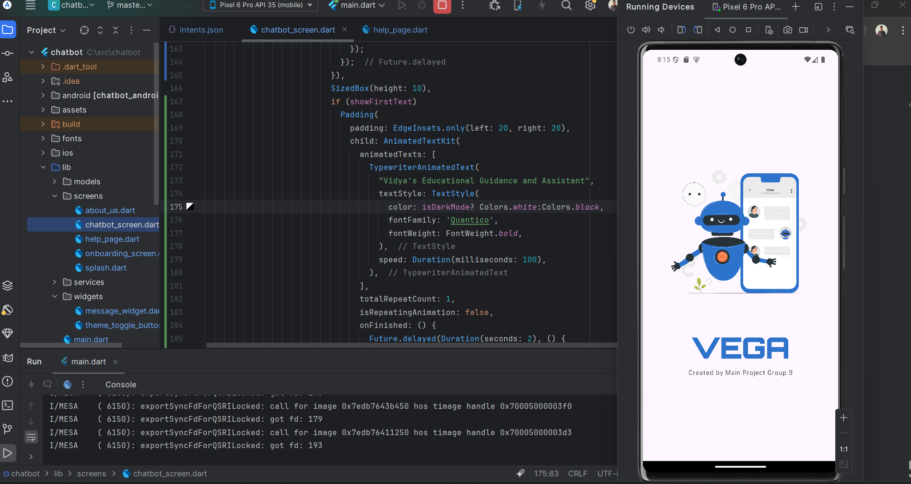
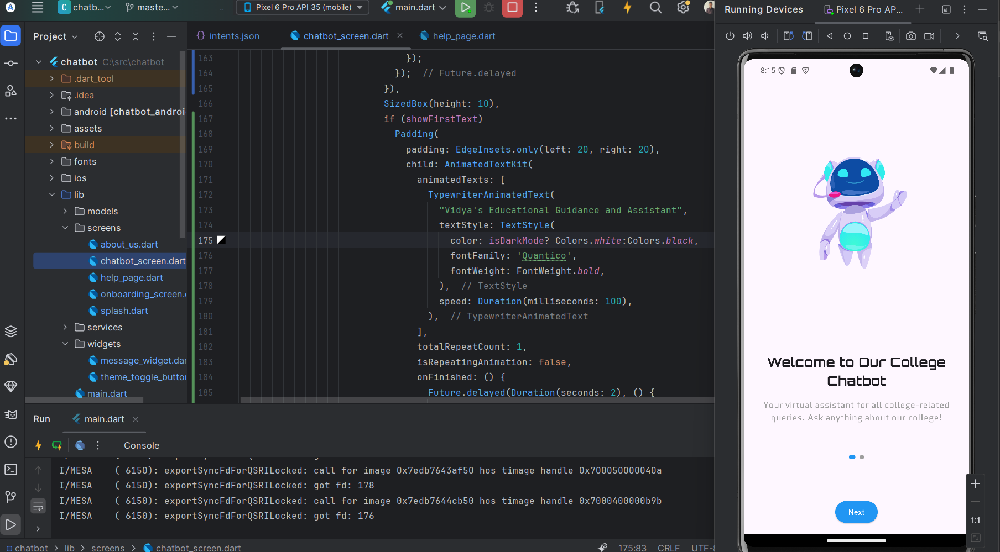
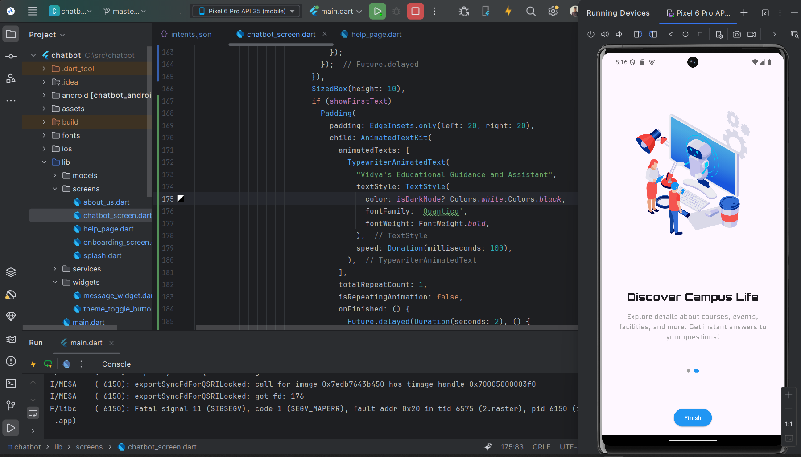
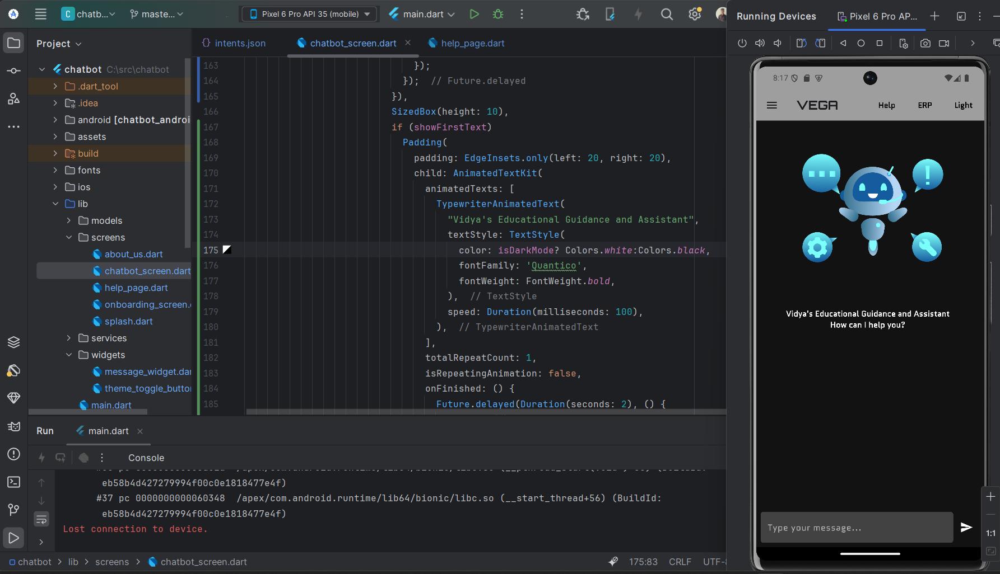
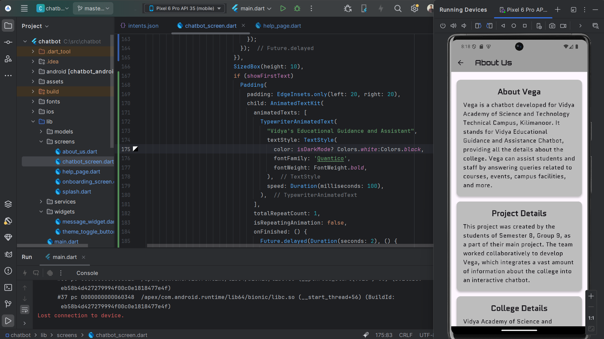
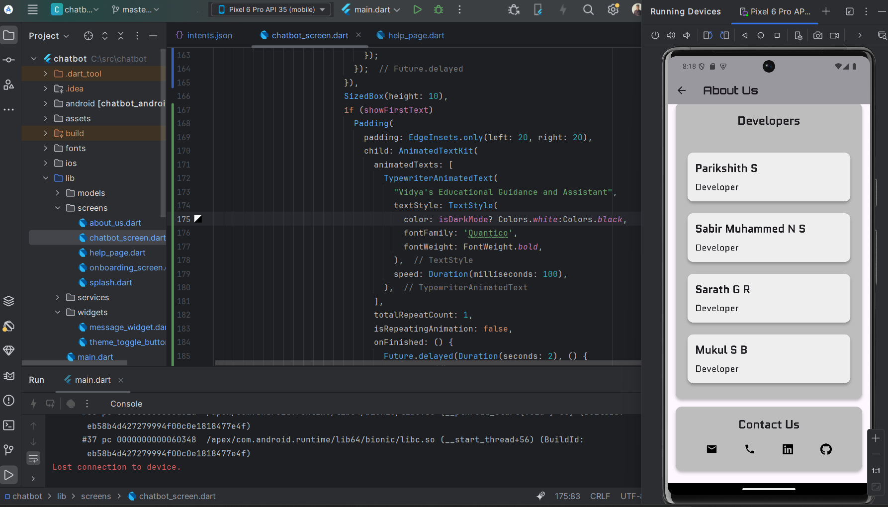
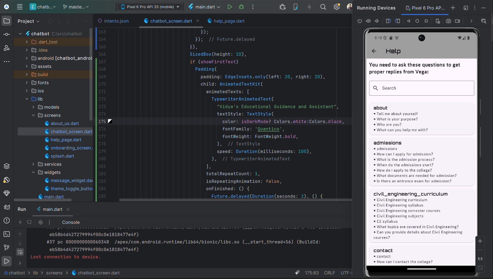

# 🤖 Chatbot

A Flutter project that features a chatbot with a clean onboarding experience.

---

## 📱 App Screenshots

### 🟦 Splash Screen


### 🟨 Onboarding Screen




### 💬 Chatbot Screen


### ℹ️ About Screen



### 🆘 Help Screen


> Make sure to add your actual images to a folder named `screenshots/` in your project directory.

---

## 🚀 Getting Started

This project is a starting point for a Flutter application.

Helpful resources:
- [Flutter Codelab](https://docs.flutter.dev/get-started/codelab)
- [Flutter Cookbook](https://docs.flutter.dev/cookbook)

---

## 🛠️ Installation

To install the dependencies:

1. Clone the repository:
   ```bash
   git clone https://github.com/your-username/your-repo-name.git
2. Navigate into the project directory:
   ```bash
   cd your-repo-name
3. Install the required dependencies:
   ```bash
   flutter pub get
